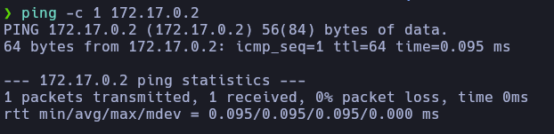
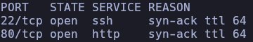
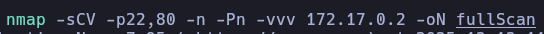
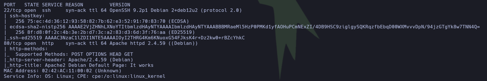
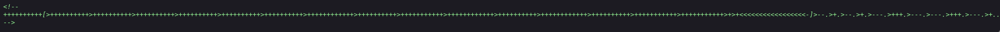
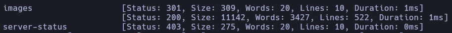
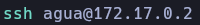
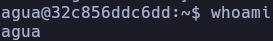
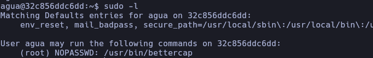
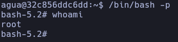

**AGUA DE MAYO**

**Difficulty:** Easy  
**Category:** Linux / Web / Docker  
**Author:** TheHackerLabs  
**Platform:** Dockerlabs

  

**1.- Enumeration**

First of all, we ensure connectivity with the target machine by sending a single ICMP packet using _ping_:

As we can see, the _TTL_ value is 64, which usually indicates that the target machine is running Linux.

The next step is to run an Nmap scan to gather information about open ports and running services.

 

  

Now that the open ports have been identified, we proceed with further enumeration:

  

  
  

With this info, we can confirm that the OS is Linux. Additionally, we have the SSH port open and the HTTP port.

**2.- Web enumeration**

In this phase, we focus on gathering information hidden within the web application. The first step is to browse the website and inspect the source code looking for useful information.

In this case, its easy to explore because it is a simple Apache default page, but in the source-code, we can find this:

  
  

The complete sequence is:

++++++++++[>++++++++++>++++++++++>++++++++++>++++++++++>++++++++++>++++++++++>++++++++++++>++++++++++>+++++++++++>++++++++++++>++++++++++>++++++++++++>++++++++++>+++++++++++>+++++++++++>+>+<<<<<<<<<<<<<<<<<-]>--.>+.>--.>+.>---.>+++.>---.>---.>+++.>---.>+..>-----..>---.>.>+.>+++.>.

This sequence does not make much sense, as it is written in Brainfuck. We simply need to decode it to obtain the information.:

  
  

Once decoded, the message reveals the string “bebeaguaqueessano”. It is too long to be a username, so it will be treated as a potential password_._

 
If we tattempt to access the SSH with generic users and this password, we will not get anything, so we have to keep looking for something in the web, for this reason, we perform directory fuzzing using ffuf:

  
  

  
  

In the directory _images_, we find an image named “agua_ssh”. Analyzing the image, we do not find anything, we treat the image name as a hint, which suggests that the username is “agua”:

  

  
  
And now we are inside the machine.

**3.- Privilege escalation**

In this final stage, we attempt to escalate privileges to obtain root access.

Before performing deeper system enumeration, some basic privilege escalation checks are performed, the first is “sudo -l”:

  
  

In this case, the command is allowed, and we are able to run bettercap with root privileges.

Executing the program and looking in the help menu, we can execute commands:

  
  

  
  

  

At this point, we successfully gain root access to the system.

  
**4.- Machine Evaluation and Lessons Learned**

Agua de Mayo is an easy-difficulty machine designed to reinforce fundamental enumeration and basic privilege escalation concepts. It is especially suitable for beginners who are starting to explore web-based challenges and Linux privilege escalation.

The machine highlights the importance of carefully inspecting web source code, as sensitive information may be hidden in unconventional formats such as obfuscated or encoded strings. In this case, understanding and recognizing Brainfuck encoding was key to obtaining valid credentials.

Additionally, this challenge demonstrates how simple sudo misconfigurations can lead to full system compromise. Allowing a user to execute tools like bettercap with root privileges represents a critical security risk if not properly restricted.

When approaching similar machines, a structured methodology is essential:

- Always begin with thorough network and service enumeration.

- Carefully inspect web applications and their source code.

- Treat unusual strings or artifacts as potential credentials or hints.

- After gaining access, immediately check sudo permissions and privilege escalation vectors.

From a defensive perspective, this machine emphasizes the need to avoid exposing sensitive information in web source code and to strictly limit sudo permissions to only what is strictly necessary.

Overall, Agua de Mayo is an excellent introductory machine that reinforces core pentesting principles and encourages a methodical approach to problem solving.
